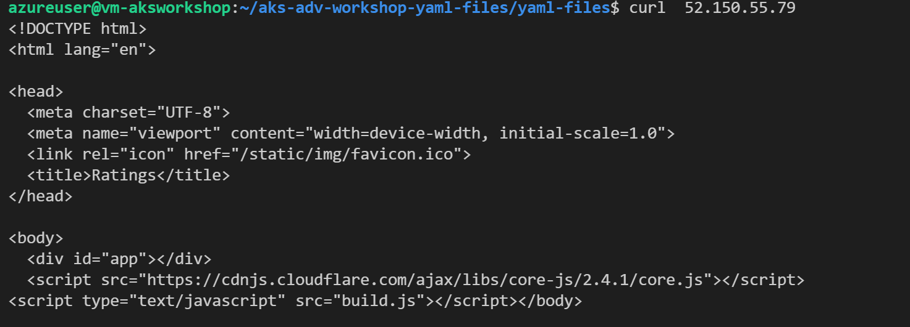
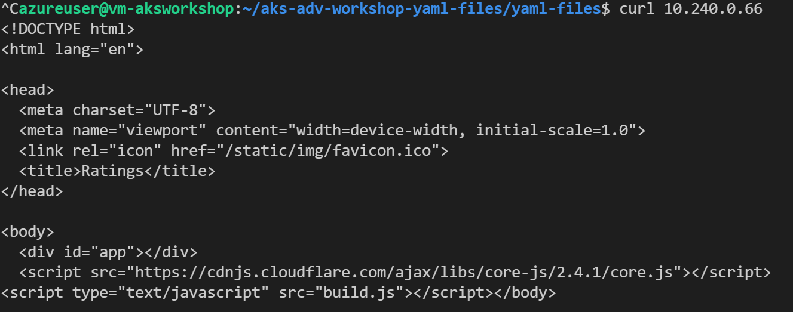
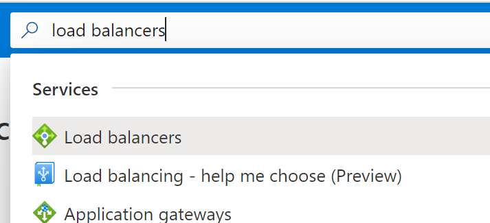
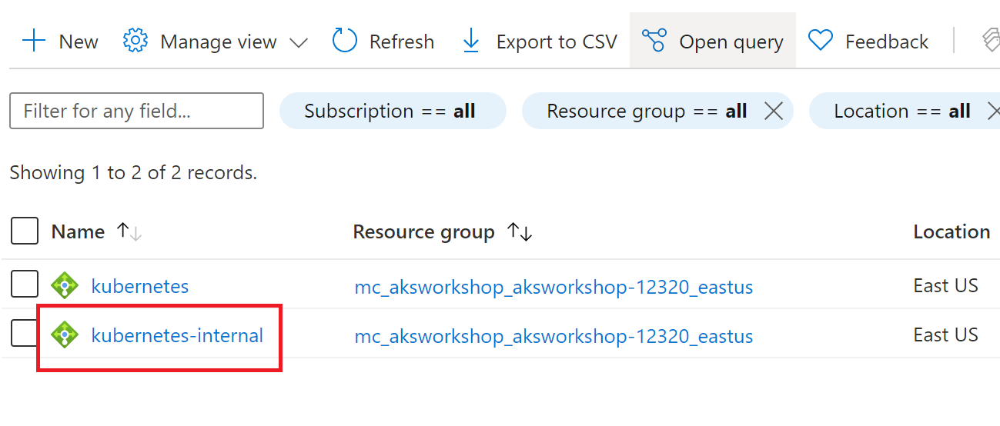
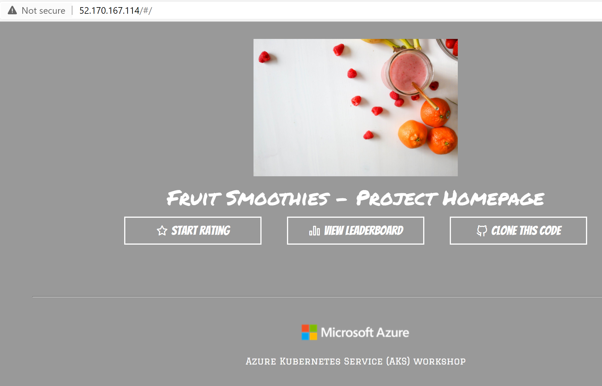

# Network and Image Security 

## Introduction

The goal of this section is to show some of the ways you can secure your AKS cluster using network security features available on AKS. The idea is for users to have access to what they need but at the same time prevent access from attackers or limit access even if a part of your cluster has been breached. In this section we will be focusing on the following:

* Securing the Control Plane
  * Limiting access to authorized IP address ranges
  * Securing using a private cluster
* Securing the Workload
  * Using Internal load balancer
  * Using Network Security groups
  * Securing using network Policies
* Securing the images
  * Using Azure defender for container registries 

## Securing the Control Plane

### Limiting access to authorized IP address ranges

In this step we will use the Azure Portal to limit IP addresses that can reach the AKS control plane.

1. Go on Azure portal and find Kubernetes Services
1. Choose your AKS cluster
1. Select **Networking** in the left hand navigation
1. Select the checkbox next to **Set authorized IP range**
1. Type 10.0.0.0 in the **Specify IP ranges** field. This is a random IP range that is not the IP of the machine you have been using to access your AKS cluster
1. Click **Save** at the top of the screen

Now try the following command using the CLI you have been using to access the cluster

```bash
watch kubectl get nodes
```

At first you may get a response. This is because it takes a few minutes for the authorized IP ranges to become configured on AKS. After a couple of minutes you would see this


Press *Ctrl + c* to exit

Next we will get the IP address of your terminal and allowlist it

#### Allowlisting IP ranges

To get the IP address of your current terminal execute the following command:

```bash
curl icanhazip.com
```

Now replace the the placeholder IP address you used earlier *10.0.0.0* with your terminal's IP address in the **Networking** section of your control plane


Finally execute the same command as before to get the list of nodes in your cluster

```bash
watch kubectl get nodes
```

Now your control plane can only be accessed from a terminal with your IP address. In a typical setup, you wouldn't configure IP addresses from just any terminal as the authorized IP on an AKS cluster, but you would rather configure wellknown IP ranges of either of your Kubernetes administrators or tools you use in production. 

> Now that you have tested this, disable this feature because you will need access to the cluster from another machine.
>
> To do that, uncheck **Set authorized IP ranges** and hit save at the top.

### Securing using a private cluster

You can also limit public access to your control plane by deploying a private cluster. This cluster can be accessed only via a private endpoint called a **Private Link**. Private clusters need to be enabled at the time the cluster is created so we will not be going into details on this here in this workshop. You can find documentation on how to implement this here: [Create a private Azure Kubernetes Service cluster - Azure Kubernetes Service | Microsoft Docs](https://docs.microsoft.com/azure/aks/private-clusters) or in Chapter 11 of the free book [Hands-on Kubernetes on Azure](https://aka.ms/handson-aks-book).

This concludes the securing a control plane section of this workshop.

## Securing the Workload

We will explore multiple ways to secure the workload. First we will secure it using an internal load balancer then we will use a network security group (NSG).

### Securing using an Internal Load Balancer

Load balancers were used during the workshop but they were public load balancers that could be accessed form the internet. This is useful when you are creating a service you only want to be accessible from within a virtual network or networks connected to that virtual network. 

#### Setting up a VM (virtual Machine) in the same VNet as the cluster

1. We start by creating a VM within the same VNet as the AKS cluster. We create this VM in a different resource group so that it can easily be deleted later. To do that we complete the following steps:
   1. Create a new subnet within that VNet
   1. Create a new resource group that will host the VM
   1. Create the VM within the subnet

   ```bash
   VM_RESOURCE_GROUP=$RESOURCE_GROUP-vm
   VM_NAME=vm-aksworkshop
   
   az network vnet subnet create \
   --resource-group $RESOURCE_GROUP \
   --vnet-name $VNET_NAME \
   --name vmsubnet \
   --address-prefix 10.200.0.0/16
   
   VM_SUBNET_ID=$(az network vnet subnet show \
   --resource-group $RESOURCE_GROUP \
   --vnet-name $VNET_NAME \
   --name vmsubnet --query id -o tsv)
   
   az group create -l $REGION_NAME \
   --name $VM_RESOURCE_GROUP
   
   az vm create --name $VM_NAME \
   --resource-group $VM_RESOURCE_GROUP \
   --image UbuntuLTS \
   --admin-username azureuser \
   --ssh-key-values ~/.ssh/id_rsa.pub \
   --subnet $VM_SUBNET_ID \
   --size Standard_D2_v2
   ```

   When the VM has been provisioned, copy the public IP address in your output.

   

1. Now that you have your VM, you can move your Kubernetes config file containing the cluster info to that VM so that you wont need to install Azure CLI on that VM to get the Kubernetes credentials. Replace public IP below with the public IP address you got from the previous step.

   ```bash
   scp ~/.kube/config azureuser@<public IP>:~
   ```

1. You can now access the new VM

   ```bash
   ssh azureuser@<public IP>
   ```

1. Install *kubectl* into the new VM.

   ```bash
   curl -LO https://dl.k8s.io/release/v1.20.0/bin/linux/amd64/kubectl
   chmod +x kubectl
   sudo mv ./kubectl /usr/local/bin/kubectl
   ```

1. Move the config files you exported to the VM in step 2 to the kube directory.

   ```bash
   mkdir .kube
   mv config .kube/config
   ```

1. Verify your connection to the cluster.

   ```bash
   kubectl get nodes
   ```

   You should be able to successfully get a list of nodes. If it doesn't work, you may have forgotten to disable the **Set authorized IP ranges** from the *Allowlisting IP ranges* section.

#### Testing with External Load Balancer

1. Since we are trying to limit resources that can access to our workloads to those within our VNet, we disable our ingress controller. We begin by getting the yaml files required for these steps.

   ```bash
   git clone https://github.com/mosabami/aks-adv-workshop-yaml-files
   
   cd aks-adv-workshop-yaml-files/yaml-files/
   ```

1. Delete the ingress for the front end of the application as well as the ratings-web `ClusterIP` service created during the aks workshop 

   ```bash
   kubectl delete -f ratings-web-ingress.yaml --namespace ratingsapp
   
   kubectl delete -f ratings-web-service.yaml --namespace ratingsapp
   ```

1. Next we recreate the ratings-web service as a `LoadBalancer` so that it is now accessible from the internet, just to make sure it works. After that check to ensure the service is now in running state.

   ```bash
   kubectl apply -f ratings-web-service-LB.yaml --namespace ratingsapp
   
   kubectl get svc --namespace ratingsapp
   ```

   You should get something similar to the picture below. Copy the public IP address.

   

1. Check to see if you can access the service exposed at that end point from the VM you just created

   ```bash
   curl <public ip>
   ```

   You should get a response similar to this one below.

   

1. Next lets see if we can do the same from the terminal that is not within the same VNet as the cluster. Type *exit* then enter to exit from the VM you just created. Enter the same command in the terminal you used to create the VM.

   ```bash
   curl <public ip>
   ```

   You receive the same response. This means the service is exposed to the public internet.

#### Setting up Internal Load Balancer

1. Reconnect to the VM you just created then delete the service exposed by the `LoadBalancer` you just created

   ```bash
   ssh azureuser@<public IP>
   cd aks-adv-workshop-yaml-files/yaml-files/
   kubectl delete -f ratings-web-service-LB.yaml --namespace ratingsapp
   ```

1. Now you will be using the internal load balancer service. Definition of this service as well as its subtle difference from regular `LoadBalancer` manifest files can be found in th *ratings-web-service-int-LB.yaml* file.

   ```bash
   kubectl apply -f ratings-web-service-int-LB.yaml --namespace ratingsapp
   
   kubectl get svc --namespace ratingsapp -w
   ```

   Wait until its external IP is available then you will notice that its external IP is actually a private IP. You can only access it from other resources within that VNet or networks connected to that VNet.

   

   >  `NodePort` type services allow access to resources outside the cluster. However `NodePort` services expose the service on the same port in each node so you can't expose multiple services on the same port in your cluster. Internal `LoadBalancer` type services eliminate this problem.

3. You can try accessing this service using the VM you just created using the following command.

   ```bash
   curl <external IP>
   ```

   

   You can't access the service from an the terminal you used to create the new VM because it is not within the same network. You can try that out yourself by exiting the VM you just created and trying the curl command.

You can find your internal load balancer service in the Azure portal.

1. Search for load balancers.

   

2. Find the internal load balancer and click on it.

   

3. You can find the matching IP address in the overview page.

   

This concludes the section on securing your cluster by restricting access to the internet using internal load balancers. Delete the internal `LoadBalancer` service.

```bash
kubectl delete -f ratings-web-service-int-LB.yaml --namespace ratingsapp
```

### Securing using Network Security Groups

In this section we will expose the application using a service with a public IP but restrict traffic using Azure's Network Security Groups (NSG). Lets start by setting up a `LoadBalancer` service with a public IP

```bash
kubectl apply -f ratings-web-service-LB.yaml --namespace ratingsapp

kubectl get service --namespace ratingsapp -w
```

Wait until the public public IP is displaced then *Ctrl+c* to exit. You should be able to connect to the service using your browser and the VM itself.



```bash
curl <public ip>
```

Now we want to secure this workload by making it so that only your browser can connect to it from the internet using a NSG.

1. Get the public IP address of the machine you are using now. If you don't know it you can browse to https://whatismyip.com to get it.

   

1. To secure the front end you will edit the *ratings-web-service-w-nsg.yaml* file. 

   ```bash
   nano ratings-web-service-w-nsg.yaml
   ```

   Replace <browser ip> with your public IPv4 IP address leaving the */32* at the end. Type *Ctrl+x* to exit, press *y* then enter to save and press enter again to save in the same filename.

   

1. Create the new service and get its IP address

   ```bash
   kubectl apply -f ratings-web-service-w-nsg.yaml --namespace ratingsapp
   
   kubectl get svc --namespace ratingsapp -w
   ```

Try opening the webpage with your browser. You will see that you now have access to the service from your computer. However, if you try connecting to the service through the virtual machine you just created by using the curl command, you'll find it doesn't have access, even though it is in the same network as the cluster. It will take up to 2 minutes to time out

```
curl <ip address>
```

You can view the NSG configuration on the Azure portal as well


Find the NSG that starts with agentpool


You can see that a rule that allows traffic from the defined IP address has been created and others are denied. This was created and managed automatically by AKS


### Securing using Kubernetes Network Policies

It is good practice to limit traffic between pods in the same cluster. That way, if an attacker somehow gains access to a pod in the cluster, they don't necessarily have direct access to other pods within that cluster. Network policies help with that and AKS makes applying them very easy. Network policies however need to be enabled at the time of creating the cluster, so for the purpose of this workshop we will not be going into details here. For AKS, you can either use Azure network policies or Calico network policies. Check find documentation for network policies here: [Secure pod traffic with network policy - Azure Kubernetes Service | Microsoft Docs](https://docs.microsoft.com/azure/aks/use-network-policies) or in the [Hands-on Kubernetes on Azure](https://www.packtpub.com/product/hands-on-kubernetes-on-azure-third-edition/9781801079945) book.
 
Always start with a zero-trust network policy for each namespace, and then expand with Ingress and Egress network rules from that point.  Example zero-trust network policies can be found in the [AKS Baseline for Regulated Workloads](https://github.com/mspnp/aks-baseline-regulated).

### Cleanup

To clean up, delete the service you just created and replace it with the regular load balancer.

```
kubectl delete -f ratings-web-service-int-LB.yaml --namespace ratingsapp
kubectl apply ratings-web-service-LB.yaml --namespace ratingsapp
```

You can also delete the VM you just created by typing *exit* then press enter to exit the VM.

```
az group delete -n $VM_RESOURCE_GROUP --yes
```

## Using Azure Defender for Container Registries

Azure Defender is an evolution of the threat-protection technologies in Azure Security Center, protecting Azure and Hybrid environments. You have to enable Azure Defender in your subscription before it begins protecting your resources and it provides comprehensive defenses for computer, data, and service layers of your environments. 

When Azure Defender for container registries has been enabled, three events can trigger an image scan:

* Whenever an image is pushed to your registry
* It scans on a daily basis any image that has been pulled in the last 30 days
* When images are imported from other registries

### Enable Azure Defender for container registries

Follow the steps below to enable this feature.

1. In the search bar, type security center and select **Security Center**

1. Click on **Pricing & Settings** in the left pane under *Management*

1. Search for your subscription using the search bar and select it

1. Click on **Azure Defender on**

   

### View and Remediate Findings

1. To view findings, go search for security center and select **Security center**

1. Click on **Recommendations** in the left pane

1. If issues were found, you'll see the recommendation **Vulnerabilities in Azure Container Registry images should be remediated**. In this case as shown in the picture below, there are none.

   

## Next step

:arrow_forward: [Security with RBAC](../Security-with-RBAC/README.md) 
