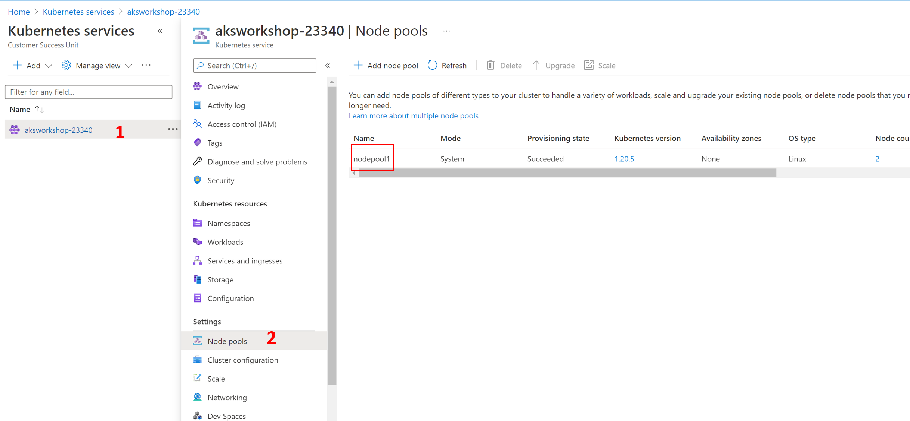

# Security 

This section contains hands-on assignments that will help you secure an AKS workload and is based on the Third Edition of the free book [Hands-on Kubernetes on Azure](https://aka.ms/handson-aks-book). You will start with a simple application deployed following the [Azure Kubernetes Service Workshop](https://docs.microsoft.com/en-us/learn/modules/aks-workshop/) and then proceed to build on it to secure your cluster. You will be working on the following building blocks:

- Network Security in AKS
- Role Based Access Control on AKS
- Azure AD pod-managed identities on AKS
- Storing Secrets in AKS 

In this tutorial we will be using Azure CLI and Azure Portal to manage the Azure resources. 

## Getting started with the workshop

### Prerequisites

* Enough knowledge in Kubernetes and AKS to understand the [Azure Kubernetes Service Workshop](https://docs.microsoft.com/en-us/learn/modules/aks-workshop/)
* An Azure Subscription
* An AKS cluster with the Fruit Smoothie workload already deployed as it is at the end of the AKS workshop 
* For some of the sections, you will need to have global administrator permissions for the Azure AD instance
* Some knowledge of computer networking is useful but not required

### Setup

You need to complete these two steps before starting out on the assignments

1. Setup environmental variables. You can get your cluster name from Azure portal and enter it below. If you followed the instruction in the AKS workshop, your AKC cluster resource group name should be *aksworkshop*

      ```bash
      REGION_NAME=eastus
      RESOURCE_GROUP=<aks resource group name>
      SUBNET_NAME=aks-subnet
      VNET_NAME=aks-vnet
      AKS_CLUSTER_NAME=<cluster name>
      ```

      

2. Disable cluster autoscaling if you haven't already

      ```bash
      az aks update --resource-group $RESOURCE_GROUP \
      	--name $AKS_CLUSTER_NAME  \
      	--disable-cluster-autoscale
      ```

3. Scale to two nodes in your cluster if you haven't already. An example of nodepool name is *nodepool1*. To check the name of your nodepool go to Azure portal go to your kubernetes cluster in the portal, click on **Node pools** in the left pane under *Settings* and you should find the name of your nodepool there under the *Name* column.

   

   ```bash
   az aks scale --resource-group $RESOURCE_GROUP \
   	--name $AKS_CLUSTER_NAME \
   	--node-count 2 \
   	--nodepool-name <nodepool name>
   ```

4. Connect to your AKS cluster by running 

   ```bash
   az aks get-credentials \
   --resource-group $RESOURCE_GROUP \
   --name $AKS_CLUSTER_NAME
   ```

5. Install the preview extension of Azure CLI

      ```bash
      az extension add --name aks-preview
      ```

6. Clone the required repository for this workshop and cd to the proper folder

      ```bash
      git clone https://github.com/mosabami/aks-adv-workshop-yaml-files
      ```


### Instructions

You can then proceed to begin the following modules in whatever order you see fit. For the workshop please follow them in order.

1. [Network and Image Security](./Network-Security/README.md)
2. [Security with RBAC](./Security-with-RBAC/README.md)
3. [Security with AAD pod-managed identities](./Security-with-AAD-pod-managed-identities/README.md)
4. [Storing Secrets with Secrets Store CSI Driver](./Storing-secrets-securely/README.md)

## Next step

:arrow_forward: [Network and Image Security](./Network-Security/README.md) 